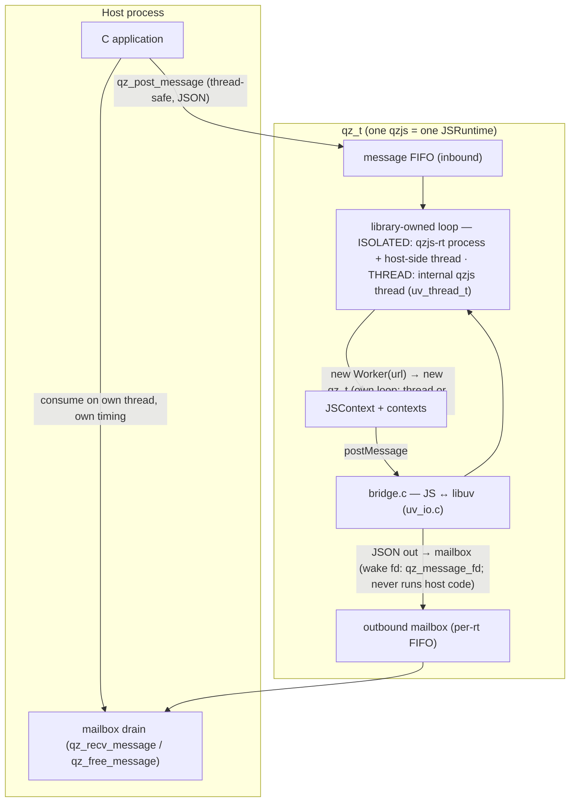

<div align="center">

<picture>
  <source media="(prefers-color-scheme: dark)" srcset="logo/logo-wordmark-dark.svg">
  
</picture>

</div>

# Qz.js — Embeddable WinterTC Runtime

> 🌐 Website & API reference: **https://adam-ikari.github.io/qzjs/**

qzjs is a lightweight, **libuv-native**, **WinterTC-compatible** runtime for embedding JS and Wasm
JavaScript in C applications. It provides a WinterTC-compatible runtime of
standard Web APIs (fetch, console, crypto, streams, timers, fs, …) and a small,
thread-safe C API for host ↔ runtime messaging and multi-context execution.
JS runs on a library-owned event loop — in a separate main-RT process
(`qzjs-rt`) under the default ISOLATED build, or on an internal `qzjs` thread
under the THREAD build. The library owns all its threads and loops and **never
runs host code**: every host-bound message (JS `postMessage`, the crash report
`{"type":"error"}`, control receipts) is delivered to a per-runtime FIFO
**mailbox** that the host drains on its own thread at its own time via
`qz_recv_message` / `qz_free_message` (waking on `qz_message_fd`). The host
never touches JS directly.

## Features

- **ES2023 engine** — full ES2023 support, fast startup (Release `qzjs -e 'console.log(1)'` median 4.82 ms after lazy WAMR init), low memory
- **WinterTC standard runtime** — WinterCG-compatible Web APIs (fetch, crypto.subtle, streams, timers, fs, serve) as globals, low overhead
- **WinterTC-compatible runtime** — 30 registered modules: fetch, console, crypto.subtle, ReadableStream, setTimeout, fs, URL, TextEncoder, WebSocket, serve() and more (verified as an ECMA-429 interface matrix + project gtest harness — the WPT runner was removed; this is interface parity, not byte-for-byte browser parity)
- **Streaming HTTP + TLS** — mbedTLS for HTTPS, chunked transfer decoding, certificate verification
- **Native extensions** — compression (miniz), crypto (mbedTLS), text codec (UTF-8/Base64), WebAssembly (WAMR default, wasm3 alternative)
- **Multi-context + Web Workers** — spawn isolated contexts (soft suspend/resume to disk); `new Worker(url)` runs real parallel threads, or dedicated processes when built with `-DQZ_PROCESS_MODEL=ISOLATED` (the default since the multi-process M-P2 milestone)
- **Host ↔ runtime mailbox** — thread-safe inbound JSON via `qz_post_message`; every outbound message (JS `postMessage`, crash reports, control receipts) queues in a per-runtime FIFO mailbox the host consumes on its own thread via `qz_recv_message` / `qz_free_message` (wake fd `qz_message_fd`); `postMessage` / `onmessage` on the JS side

## Quick Start

### Build

```bash
git clone --recursive https://github.com/adam-ikari/qzjs.git
cd qzjs
make build          # → build/qzjs build/qzc build/qzjs-rt
```

`make` is the command entry point (`make help`-style target list lives in the
`Makefile` header): `make build` / `make qzjs ARGS='...'` / `make qzc SRC=...`
/ `make bc SRC=...` / `make example NAME=fs` / `make test-offline` /
`make docs`. Under the hood these drive CMake/Ninja; raw CMake still works
(see [Building](docs/guide/building.md) for every option).
The WinterTC polyfill ships as precompiled bytecode with the JavaScript source
stripped (`qjsc -s`), shrinking the embedded polyfill bytecode by ~87%.
Polyfill initialization is lazy: core infrastructure (console, timers, event
targets, abort, URL, encoding, performance, navigator, structured clone, ...)
is set up at injection, while heavier or scenario-specific APIs (fetch,
streams, blob, worker, message-channel, caches, websocket, serve, fs,
storage, crypto.subtle, ...) initialize on first access. JS consumers observe
no difference — every name is visible (`in`/`Object.keys`) before first use
and resolves to the same descriptors as an eager install — so unused feature
APIs cost no setup time, closures, or resident instances.
The native WAMR runtime initializes lazily on first WebAssembly use as well —
end-to-end CLI startup (Release) dropped from 10.33 ms to **4.82 ms** median
for scripts that never touch `WebAssembly`.

### Minimal Example

```c
#include <qzjs/qzjs.h>
#include <stdio.h>

int main(void) {
    qz_config_t cfg = {0};
    cfg.initial_script = "globalThis.onmessage = function (e) { postMessage('pong'); };";
    qz_t *rt = qz_create(&cfg);   /* no callback, no loop injection */
    if (!rt) return 1;

    /* thread-safe inbound message; the runtime processes it on its own loop */
    qz_post_message(rt, "{\"cmd\":\"ping\"}", 14);

    /* drain the mailbox on this thread — the library never runs host code */
    for (;;) {
        char *json = NULL; size_t len = 0;
        int r = qz_recv_message(rt, &json, &len, 1000);  /* wait up to 1 s */
        if (r != 0) break;                               /* 1 = timeout, -1 = error */
        printf("received: %.*s\n", (int)len, json);
        qz_free_message(json);                           /* release the malloc buffer */
    }

    qz_destroy(rt);  /* graceful shutdown: terminate main RT → reap → free */
    return 0;
}
```

`qz_create` spawns/blocks until the runtime is ready and `initial_script`
has been evaluated (a thrown exception makes `qz_create` return NULL). Under
ISOLATED the library spawns the main-RT process plus **its own** host-side thread
and loop (never yours); frames that arrived before the ready handshake
are already replayed into the mailbox, so the host's very first `qz_recv_message`
picks them up. Every `postMessage` from JS lands in the per-runtime mailbox —
the library never calls back into host code — and the host consumes it on
whichever thread and at whichever time it chooses: `qz_recv_message` takes
`timeout_ms` `0` for a pure poll, `>0` to wait up to that many ms, `-1` to block
forever, and returns a malloc'd NUL-terminated JSON buffer you release with
`qz_free_message`. `qz_message_fd(rt)` exposes an `eventfd` you can add to your
own poll/epoll/select. The same program runs unchanged under the THREAD build.

### Examples

Runnable samples live in [`examples/`](examples/), built with `QZ_BUILD_EXAMPLES=ON`:

```bash
make build                          # QZ_BUILD_EXAMPLES=ON included
./build/examples/hello/qz_hello     # host ↔ JS messaging
./build/examples/worker/qz_worker   # real-thread Web Worker round-trip
make example NAME=fs                # run a JS example directly
```

### Build with Tests

```bash
make test            # full suite (incl. test262)
make test-offline    # offline label — right default on a fresh clone
```

## Standalone CLI

qzjs ships a standalone runtime executable (built by default, `QZ_BUILD_CLI=ON`)
that runs WinterTC Web APIs directly — no Node.js APIs (`process`, `require`,
`Buffer` are absent by design).

```bash
make build                       # produces build/qzjs build/qzc build/qzjs-rt

./build/qzjs script.js a b c     # run a script, args via globalThis.arguments
./build/qzjs -e 'await fetch(url)' # evaluate a one-liner
./build/qzjs                     # interactive REPL (Ctrl-D to exit)
./build/qzjs --help
./build/qzjs --version
```

- **`globalThis.arguments`** — script args as an array (WinterCG
  `proposal-cli-api` direction; excludes the executable and script path)
- **`globalThis.env`** — process environment as a plain object
- **Async exit** — the runtime waits for pending async work (fetch, timers,
  streams) to complete before exiting, so top-level `await`-style scripts run to
  completion
- **Console routing** — `console.log`/`info`/`debug` → stdout,
  `console.warn`/`error` → stderr

```bash
./build/qzjs -e 'console.log(JSON.stringify(globalThis.arguments))' a b c
# => ["a","b","c"]
```

## Architecture



By default (`QZ_PROCESS_MODEL=ISOLATED`, multi-process M-P2) the host and the
main runtime are **separate processes**: `qz_create` spawns
`qzjs-rt --qzjs-rt-server`, then the two sides exchange FlatBuffers-framed
envelopes over a socketpair — a runtime crash (or a hard-killed runtime) cannot
take the host down. The library owns the host-side channel **and its host-side
thread/loop** itself: it never runs host code, asks for no injected `uv_loop`,
and fires no callback. All outbound messages land in a per-runtime FIFO mailbox
the host drains on its own thread via `qz_recv_message` / `qz_free_message`,
optionally waking on `qz_message_fd` (an `eventfd` you integrate into your own
poll/epoll/select). Build with `-DQZ_PROCESS_MODEL=THREAD` for the
single-process baseline (one internal qzjs thread per runtime; same mailbox,
host drives nothing). In both models JS runs on the runtime's own loop: the host
drives work by posting JSON messages (`qz_post_message`, thread-safe) and
consuming replies from the mailbox.

## API Reference

### Core API

| Function | Description |
|----------|-------------|
| `qz_create(config)` | Create runtime. ISOLATED: spawns the main-RT process plus the library's own host-side thread + loop (never the host's), blocks until mainRT's `CONTROL{ready}`; frames that arrived before ready are replayed into the mailbox. THREAD: starts the internal qzjs thread. Blocks until ready + `initial_script` eval'd. Returns NULL on failure. |
| `qz_destroy(rt)` | Graceful force-terminate: shutdown main RT (process/thread) → reap → free (ISOLATED worst-case ≤2s, handled inside the library thread). Unconsumed mailbox messages are freed — drain first via `qz_recv_message` if you need them. Host thread only, NULL-safe. |
| `qz_post_message(rt, json, len)` | Thread-safe inbound JSON message (copied). Returns 0 / -1. |
| `qz_recv_message(rt, json, len, timeout_ms)` | Pop one message from the outbound mailbox. `timeout_ms`: `0`=pure poll, `>0`=wait up to N ms, `-1`=block forever. Returns `0`=got one (`*json` malloc, NUL-terminated; release with `qz_free_message`), `1`=timeout, `-1`=param/state error. |
| `qz_free_message(json)` | Release a `qz_recv_message` buffer. NULL-safe. |
| `qz_message_fd(rt)` | The rt's wake fd (`eventfd`) — add to your own poll/epoll/select; readable ⇒ ≥1 message pending. Owned by rt: never close it; invalid after `qz_free`. Linux-only. |
| `qz_wait_idle(rt)` | Request auto-exit when no async work pending, block until the main body exits. Messages keep entering the mailbox during the wait; after it returns, drain with `qz_recv_message` then free with `qz_free` (not `qz_destroy`). |
| `qz_free(ptr)` | Dual-role: a torn-down rt → drains mailbox, closes wake fd, frees config buffers + rt; a plain malloc blob (e.g. from `qz_compile`) → plain free. NULL-safe. |

### Configuration (`qz_config_t`)

| Field | Description |
|-------|-------------|
| `initial_script` | Eval'd inside the runtime at create (main-RT process under ISOLATED, qzjs thread under THREAD); a throw → `qz_create` returns NULL. |
| `debug` | DAP debugger bits (see Debugging). |

`qz_config_t` carries no callback and no loop: the library never runs host
code, so host-bound output is pulled from the mailbox (`qz_recv_message`), not
pushed to a callback. See [Embedding](docs/guide/embedding.md) for the full config
(`control_plane`, `worker_backend`, `initial_script_path`, `initial_bytecode`).

### Multi-context

Multi-context (spawn/suspend/resume and `qzContext.*`) and Web Workers are
JS-level APIs — see the [docs](https://adam-ikari.github.io/qzjs/) for
`qzContext.spawn` / `suspend` / `resume` and `new Worker(url)`.

### Extensions

Extensions are registered at build time via the `QZ_EXTENSIONS` macro (see
`include/qzjs/qz_ext_registry.h`); there is no runtime registration API.
Built-in extensions (compress/crypto/textcodec/wamr) are auto-registered when
their `QZ_WITH_*` is on. A parent project adds its own extension to the table
non-invasively via the CMake `QZ_EXTENSIONS` / `QZ_EXTRA_SOURCES` variables.

## CMake Options

`QZ_WITH_*` toggles optional native extensions layered on the runtime. libuv
itself is a **hard dependency** (always built from `deps/libuv`) — there is no
platform-backend option anymore.

### Feature Toggles (`QZ_WITH_*`)

| Option | Default | Description |
|--------|---------|-------------|
| `QZ_WITH_WAMR` | ON | WAMR WebAssembly engine (Fast Interp + AOT) |
| `QZ_WITH_WASM3` | OFF | wasm3 WebAssembly engine (alternative; mutually exclusive with WAMR) |
| `QZ_WITH_TLS` | ON | mbedTLS HTTPS (forces `QZ_WITH_CRYPTO_EXT=ON`) |
| `QZ_WITH_COMPRESS` | ON | miniz compression extension |
| `QZ_WITH_CRYPTO_EXT` | ON | crypto.subtle extension (undefined when OFF) |
| `QZ_WITH_TEXTCODEC` | ON | UTF-8/Base64 extension |
| `QZ_WITH_NONUTF_ENCODINGS` | OFF | non-UTF encoding labels (Latin-1, replacement) in TextDecoder |

### Build Profiles (`QZ_PROFILE`)

`QZ_PROFILE` 是 `QZ_WITH_*` 各项的预设包，**只改未显式指定的项**：
`-DQZ_PROFILE=minimal -DQZ_WITH_TLS=ON` 中显式的 `TLS=ON` 赢。空值
（默认）时各项行为与历史默认逐位一致。取值 `minimal | standard`，其他值
configure 报错。所有命名档位均满足 ECMA-429 WinterTC 全量必选集。

| Profile | 宏效果 | qzjs 尺寸（strip 后，实测） | ECMA-429 WinterTC | 适用场景 |
|---------|--------|---------------------------|-------------------|----------|
| `standard`（与空 profile 等效） | 与历史默认相同：WAMR/TLS/COMPRESS/CRYPTO_EXT/TEXTCODEC=ON | 同默认构建 | ✅ 全量必选满足 | 通用运行时 |
| `minimal` | 同 standard 但 **TLS=OFF**（fetch 降级 http-only；ECMA-429 不含 HTTPS） | **2.45 MiB**（Release/-O3）；1.81 MiB（MinSizeRel/-Os） | ✅ 全量必选仍满足：atob/btoa、WebAssembly（WAMR）、crypto.subtle、CompressionStream 全部在 | 嵌入式/尺寸敏感，仍需过 WinterTC 一致性 |

实测命令与行为探测（2026-09-12，x86_64 Linux）：

```bash
cmake -S . -B build_profile_min -DQZ_PROFILE=minimal -DCMAKE_BUILD_TYPE=Release
cmake --build build_profile_min -j
strip build_profile_min/qzjs   # 2,573,536 B
./build_profile_min/qzjs -e 'console.log(typeof btoa, typeof WebAssembly, typeof crypto?.subtle, typeof CompressionStream)'
# minimal: function object object function
```


### gRPC Stack (`QZ_WITH_GRPC`)

`QZ_WITH_GRPC`（默认 OFF）现在是 CMake option：ON 时构建系统向
polyfill rebuild 传 `QZ_WITH_GRPC=1`，把 gRPC/HTTP2 栈（h2 + HPACK +
protobuf + grpc，~3.5k 行 JS）编进 `build/<bin>/generated/polyfill/polyfill_default.c`（中间产物不落 src/）。依赖 npm +
esbuild + qjsc（polyfill rebuild 本来就依赖，无新增前提）。手工路径仍是
`QZ_WITH_GRPC=1 node src/polyfill/build.js`。

> Note: before `QZ_WITH_GRPC` was a CMake option, the stack was gated only
> inside the polyfill **build** step (`QZ_WITH_GRPC=1 node
> src/polyfill/build.js`). The CMake option drives the same rebuild
> automatically; the manual path still works.

### Build Targets (`QZ_BUILD_*`)

| Option | Default | Description |
|--------|---------|-------------|
| `QZ_BUILD_TESTS` | OFF | Build test suite |
| `QZ_BUILD_DEBUGGER` | OFF | DAP step-debugger (adds `src/debugger.c` + `src/debugger_dap.c`) |

### Library Outputs

| Target | Description |
|--------|-------------|
| `libqzjs.a` | Static core. Deliberately does **not** link libuv — uv symbols resolve at the final executable. |
| `libqz_full.a` | CMake link-interface aggregator: qzjs + real libuv + mbedTLS + miniz + WAMR + pthread/dl/rt. |
| `qzjs.pc` | pkg-config. `pkg-config --cflags --libs qzjs` yields the full static link line (all vendored archives). |

## WinterTC Modules

| Module | Globals | Backend |
|--------|---------|---------|
| fetch | `fetch`, `Headers`, `Request`, `Response` | libuv (uv_io.c) |
| console | `console` | stdout |
| crypto | `crypto`, `crypto.subtle` | ext_crypto (mbedTLS) |
| streams | `ReadableStream`, `WritableStream` | — |
| timers | `setTimeout`, `setInterval` | libuv timers |
| fs | `fs.read`, `fs.write` | libuv (uv_io.c) |
| storage | `storage.get/set/delete` | libuv in-memory map |
| encoding | `TextEncoder`, `TextDecoder` | ext_textcodec |
| url | `URL`, `URLSearchParams` | — |
| abort | `AbortController`, `AbortSignal` | — |
| performance | `performance.now()` | libuv hrtime |
| event-target | `EventTarget`, `Event` | — |
| blob | `Blob`, `File`, `FormData` | — |
| message-channel | `MessageChannel`, `MessagePort` | — |
| navigator | `navigator` | — |
| structured-clone | `structuredClone` | — |
| error-events | `ErrorEvent` | — |

## Dependencies

All dependencies are built from source via CMake `add_subdirectory` — qzjs
never links system libraries, and each dep's objects live in the main build
tree (subject to `-j` and incremental rebuild). All are git submodules with
pinned versions. qzjs and all its dependencies build under **strict C99** (`-std=c99`).

| Dependency | Source | Required | Purpose |
|------------|--------|----------|---------|
| JS engine | git submodule | Yes | (C99) |
| libuv | git submodule | Yes | Event loop / I/O backend (C99; atomics patched) |
| mbedTLS | git submodule | No (QZ_WITH_TLS) | TLS / crypto (C99) |
| miniz | git submodule | No (QZ_WITH_COMPRESS) | Compression (C90) |
| WAMR | git submodule | No (QZ_WITH_WAMR) | WebAssembly engine (default) |
| wasm3 | git submodule | No (QZ_WITH_WASM3) | WebAssembly engine (alternative) |

### npm Polyfill 构建依赖

polyfill 构建期引入 npm 依赖（esbuild + 3 个库），均 devDependencies，不随二进制发布：

| 包名 | 版本 | 许可 | 目标 polyfill | 说明 |
|------|------|------|--------------|------|
| `urlpattern-polyfill` | 10.1.0 | MIT | `src/polyfill/src/url-pattern.js` | URLPattern 规范实现 |
| `@ungap/structured-clone` | 1.4.0 | ISC | `src/polyfill/src/structured-clone.js` | 深拷贝算法，保留 qzjs 扩展分支（MessagePort transfer、ArrayBuffer transfer、DataView offset/len、Blob/File、DOMException） |
| `web-streams-polyfill` | 4.3.0 | MIT | `src/polyfill/src/streams.js` | 三大流类规范实现（ReadableStream / WritableStream / TransformStream） |

> 注：whatwg-url 未引入（tr46 IDNA 485KB 依赖链过大 + esbuild IIFE 时序冲突），保留自研。

## Thread Safety

- **All JS runs on the runtime's own single loop** — the `qzjs-rt` process under ISOLATED (default), the internal `qzjs` thread under THREAD; the library additionally owns a host-side thread under ISOLATED. The host never calls into JS directly, and the library never calls back into host code.
- `qz_create` / `qz_destroy` are host-thread calls. The blocking host APIs (`qz_ping`, `qz_ping_path`, `qz_wait_idle`, `qz_destroy`) do their waiting on the **library's** host-side thread; the mailbox is unaffected and stays readable from any host thread. After `qz_wait_idle` free the runtime with `qz_free(rt)`, not `qz_destroy`.
- `qz_post_message` is **thread-safe** in both models (any thread may call it; the JSON is copied). FIFO order per runtime is preserved.
- **Mailbox consumption:** any thread may call `qz_recv_message`, but **only one at a time per runtime** — the lock-free pop is *not* mutually exclusive, so two concurrent pollers read the same head node and deliver and free it twice. Serialize consumption in the host. The JSON payload is NUL-terminated (`len` excludes the terminator); release each buffer with `qz_free_message`. Handing a taken message to another thread is the host's job.
- There is **no host loop to drive and no same-link libuv requirement**: add `qz_message_fd` (an `eventfd`) to your own poll/epoll/select. It is owned by the runtime — never close it; it becomes invalid after `qz_free`. Unconsumed messages are freed at `qz_destroy`/`qz_free`. Linux-only. When waiting on the fd, drain (`qz_recv_message(...,0)`) → clear the fd (`read` until `EAGAIN`) → re-probe once before blocking, so no wakeup is lost.
- Worker contexts each run on their own loop — thread or process depending on the worker backend (real parallelism).

## Debugging

qzjs ships a DAP (Debug Adapter Protocol) step-debugger built into the
library — step-debug any embedded program in VS Code. Enable with
`-DQZ_BUILD_DEBUGGER=ON` (adds breakpoint/step
primitives; zero overhead when OFF). Run your program with `QZ_DEBUG=1`
(or set bit 1 of `qz_config_t.debug`) and VS Code attaches with
`request:"attach"`. See [docs/dev/debugging.md](docs/dev/debugging.md) for
the full setup, launch.json, and limitations.

## Testing

Tests are GoogleTest `.cpp` suites in `test/`, linked against `qzjs` plus
`mock_libuv` (a fake `uv_*` API for deterministic offline tests — see
`test/mock_libuv.h` and the `HostCtx` harness in `test/test_host.h`).

```bash
# Unit tests (offline label — the right default on a fresh clone)
make test-offline

# With valgrind
valgrind --leak-check=full ./build/test/test_qzjs_gtest
```

`ctest -L offline` is the right default: a fresh clone has no test262 corpus
(it is an upstream submodule with `update = none`), so a bare
`ctest --output-on-failure` fails on `test262_quickjs`. To run it too:

```bash
git -C deps/quickjs-ng submodule update --init --depth 1 test262
ctest -L test262
```

Tests are labelled for selection (`ctest -L <label>`; `ctest --print-labels`
lists what this build actually registered):

- `offline` — local, deterministic (default; what CI runs)
- `dap` — DAP debugger end-to-end (needs `-DQZ_BUILD_DEBUGGER=ON`)
- `test262` — ECMAScript conformance (needs the corpus, see above)

## Contributing

See [CONTRIBUTING.md](CONTRIBUTING.md) for setup, style, the PR checklist,
and the release process.

## Security

To report a vulnerability, see [SECURITY.md](SECURITY.md) — please use
private reporting rather than a public issue. That page also states the
threat model explicitly (qzjs runs trusted script; it is not a sandbox for
untrusted code).

## License

MIT
