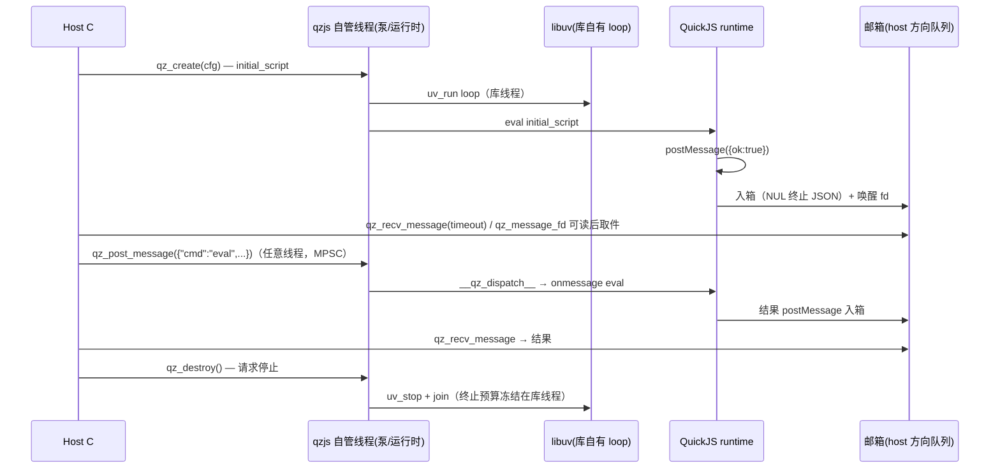

# Key flows

## End-to-end path of a typical request（宿主→JS 消息；M-P7 目标态 = mailbox）

**现状差异（过渡态 M-P6，已实现）**：ISOLATED 下无库侧宿主泵线程——通道句柄挂宿主注入的
cfg.uv_loop，message_cb 在泵宿主 loop 的线程触发，阻塞 API 就地 NOWAIT 泵，邮箱/唤醒 fd
不存在；M-P7 实施后本图取代 M-P6 语义（见 [[multi-process-model]]）。

## Other important flows

- Worker 生命周期：qzjs 内部新建线程 → QuickJS 独立 JSRuntime → __qz_dispatch__ 消息通道
- MessagePort 跨线程：pal.portCreate() 分配全局 port id 对 → 序列化到字节通 → 接收侧 __qz_port_from_ref__ 重建代理
- HTTPServer 请求：serve() raw TCP accept → JS 解析 HTTP/1.1 → JS handler（fetch 风格）→ JS 构造 Response → 经 tcp/TLS 原语回写
