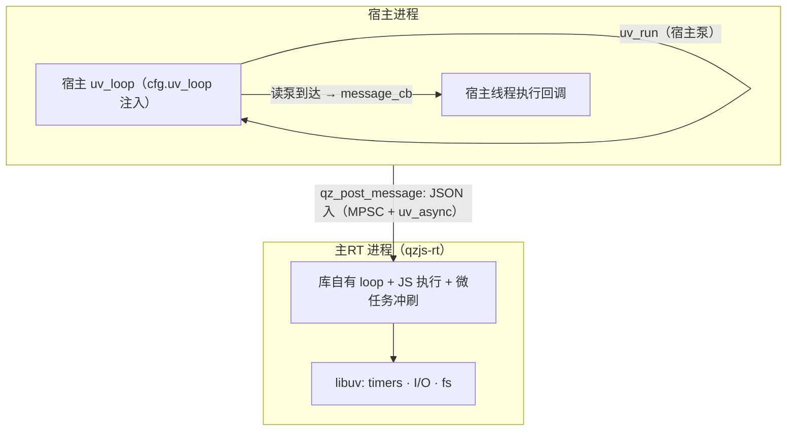

# Event Loop

qzjs runs its event loop in one of two shapes, selected at build time by
`QZ_PROCESS_MODEL` (default `ISOLATED`):

- **ISOLATED** — JS runs in a separate main-RT *process* (`qzjs-rt`). The host
  side of the library owns **no thread and no loop**: you inject your own
  `uv_loop_t` via `cfg.uv_loop`, the library binds its host-side channel
  handles (pipe read pump, wake async, tx-spill timer) onto it, and
  `message_cb` fires **on the thread that pumps your loop**.
- **THREAD** — the library starts an internal `qzjs` thread running an embedded
  libuv loop. All JS and `message_cb` run on that thread; the host pumps
  nothing.

## Who Runs the Loop (ISOLATED — default)



The host owns its loop and its pumping schedule; the library only borrows it.
`qz_create` spawns the main-RT process, completes the handshake on a
synchronous raw-fd read (no pumping, no callbacks during create — pre-ready
script messages are buffered and replayed in FIFO order once the read pump is
registered), then attaches its channel handles to `cfg.uv_loop`. Passing
`cfg.uv_loop = NULL` under ISOLATED makes `qz_create` fail explicitly — the
library never falls back to an internal host thread. Host and libqzjs must
link the **same** libuv.

## Who Runs the Loop (THREAD build)

`qz_create` starts a dedicated internal thread (`uv_thread_t`) that runs a
libuv loop embedded in the runtime. That loop drives all async work — HTTP,
file I/O, timers — and all JS runs on the same thread, so Promise microtasks
are flushed naturally between loop iterations. The host thread never touches
the loop.

## How the Host Drives Work (ISOLATED)

```c
#include <qzjs/qzjs.h>
#include <uv.h>
#include <stdio.h>
#include <string.h>

static void on_message(qz_t *rt, const char *json, size_t len, void *data) {
    (void)rt; (void)data;
    printf("received: %.*s\n", (int)len, json);
}

int main(void) {
    uv_loop_t loop;
    uv_loop_init(&loop);

    qz_config_t cfg = {0};
    cfg.initial_script =
        "globalThis.onmessage = function (e) { postMessage('pong'); };";
    cfg.message_cb = on_message;
    cfg.uv_loop    = &loop;            /* 宿主 loop 注入（ISOLATED 必填） */

    qz_t *rt = qz_create(&cfg);
    if (!rt) return 1;

    qz_post_message(rt, "{\"cmd\":\"ping\"}", 14);

    /* 泵宿主 loop：reply 到达时 on_message 在本线程触发。宿主自己的
       事件调度可完全接管这里 —— 有 loop 要转的宿主天然就兼容。 */
    while (uv_run(&loop, UV_RUN_ONCE)) { /* until done */ }

    qz_destroy(rt);                     /* 库句柄已随 teardown 关闭 */
    uv_loop_close(&loop);
    return 0;
}
```

In a THREAD build the same program needs no `uv_loop` at all: `message_cb`
fires on the library's qzjs thread while the host does its own work.

## Thread & Reentrancy Rules

- `qz_post_message` is thread-safe (the JSON is copied) under both models —
  call it from any thread. Delivery latency under ISOLATED equals your pump
  frequency; FIFO order per runtime is preserved.
- Under ISOLATED the blocking host APIs (`qz_ping`, `qz_ping_path`,
  `qz_wait_idle`, `qz_destroy`) **pump `cfg.uv_loop` internally**
  (`UV_RUN_NOWAIT` + yield) — otherwise a single-threaded host would
  deadlock itself. Consequence: `message_cb` (including the crash
  `{"type":"error"}` report) may fire **reentrantly inside these calls**.
- Therefore: **never call a blocking host API from inside `message_cb`**
  (nested `uv_run`), and keep the callback fast — it runs on your loop's
  thread. Heavy work belongs back on your own thread/queue.
- The library never calls `uv_run(UV_RUN_DEFAULT)` or `uv_loop_close` on your
  loop; after `qz_wait_idle`/`qz_destroy` all library handles attached to it
  are closed, so `uv_loop_close` on the host loop succeeds.

## Why This Design

- ISOLATED keeps the host in charge of its own event loop: zero library-owned
  host-side threads, integration is "pass your loop and keep pumping".
- JS execution and every async event are serialized inside the main-RT
  process's single loop — no locks, no races inside the runtime.
- Microtasks are flushed automatically between loop iterations (in the
  main-RT process under ISOLATED, on the qzjs thread under THREAD).
