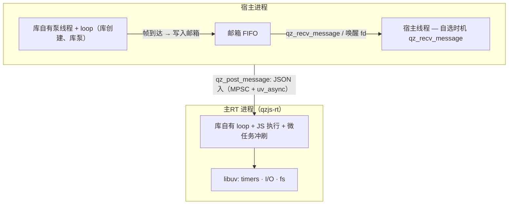

# Event Loop

qzjs works in one of two shapes, selected at build time by
`QZ_PROCESS_MODEL` (default `ISOLATED`). In **both** shapes the story is the
same: **the library pumps its own loop/thread and never runs host code**.
The host does not run or inject a loop — it consumes the mailbox on its own
thread at its own time:

- **ISOLATED** — JS runs in a separate main-RT *process* (`qzjs-rt`), and the
  library additionally starts its **own host-side pump thread + loop** inside
  your process. All host-bound messages (JS `postMessage`, the crash
  `{"type":"error"}` report, CONTROL receipts) are written to a per-runtime
  FIFO **mailbox**, drained with `qz_recv_message`.
- **THREAD** — the library starts an internal `qzjs` thread running an
  embedded libuv loop. All JS runs on that thread; output goes to the same
  mailbox.

## Who Runs the Loop (ISOLATED — default)



The library owns every thread and loop on both sides of the boundary; nothing
is borrowed from the host. `qz_create` spawns the main-RT process, completes
the ready handshake on a synchronous raw-fd read, and starts the library's
host-side pump thread. Frames that arrive before ready are already replayed
into the mailbox, so the host's first `qz_recv_message` gets them. The host
injects no loop and pumps nothing, and there is **no same-libuv linking
obligation** between host and libqzjs — libuv is the library's internal
dependency (the host may embed qzjs in any event system: poll/epoll/select,
its own threads, or none).

## Who Runs the Loop (THREAD build)

`qz_create` starts a dedicated internal thread (`uv_thread_t`) that runs a
libuv loop embedded in the runtime. That loop drives all async work — HTTP,
file I/O, timers — and all JS runs on the same thread, so Promise microtasks
are flushed naturally between loop iterations. The host thread never touches
the loop; it just reads the mailbox.

## How the Host Consumes Output (ISOLATED)

```c
#include <qzjs/qzjs.h>
#include <stdio.h>

static void host_drain(qz_t *rt, int timeout_ms) {
    for (;;) {
        char *json = NULL; size_t len = 0;
        int r = qz_recv_message(rt, &json, &len, timeout_ms);
        if (r != 0) break;
        printf("received: %.*s\n", (int)len, json);
        qz_free_message(json);
        timeout_ms = 0;   /* 首条到达后转纯轮询排干 */
    }
}

int main(void) {
    qz_config_t cfg = {0};
    cfg.initial_script =
        "globalThis.onmessage = function (e) { postMessage('pong'); };";

    qz_t *rt = qz_create(&cfg);
    if (!rt) return 1;

    qz_post_message(rt, "{\"cmd\":\"ping\"}", 14);

    /* 在本线程、按自己的节奏消费邮箱 —— 库自己泵，宿主无需驱动任何东西。 */
    host_drain(rt, 2000);

    qz_destroy(rt);
    return 0;
}
```

This program is pure POSIX: no libuv, no loop to run. In a THREAD build it
works unchanged.

### Plugging into your own event system (wake fd)

To avoid a plain blocking wait inside an existing poll/epoll/select loop, add
`qz_message_fd(rt)` to your fd set: it is an `eventfd` (monotonic counter,
non-blocking, CLOEXEC) that turns readable when ≥1 message is pending. When
you wait on the fd, follow this protocol — it prevents lost wakeups, because
a message is linked into the mailbox *before* the eventfd is written:

1. `qz_recv_message(rt, &json, &len, 0)` — drain and **process** until it
   returns non-0.
2. `read(qz_message_fd(rt), ...)` — clear the eventfd counter until `EAGAIN`.
3. Re-probe `qz_recv_message(..., 0)` once more — if it returns a message, go
   back to step 1; only when it is empty may you `poll()` block.

The fd is owned by the runtime: do NOT close it; it becomes invalid after
`qz_free`. Linux-only.

## Thread & Reentrancy Rules

- `qz_post_message` is thread-safe (the JSON is copied) under both models —
  call it from any thread. FIFO order per runtime is preserved; delivery is
  driven by the library's own pump thread, not by the host's schedule.
- `qz_recv_message` may be called concurrently from multiple threads (the
  mailbox pop is mutually exclusive). But at most **one** thread should be the
  "fd waiter"; cross-thread ownership handoff of taken messages is the host's
  job.
- The blocking APIs (`qz_ping`, `qz_ping_path`, `qz_wait_idle`, `qz_destroy`)
  do their waiting **on the library's pump thread**; the caller simply blocks.
  The mailbox is unaffected — outbound messages (including the crash
  `{"type":"error"}` report) keep entering it during the wait, and
  `qz_recv_message` still works after `qz_wait_idle` returns and before
  `qz_free`.
- There is no reentrancy hazard to design around: qzjs never executes host
  code, so no library thread can call into you. Drain the mailbox from
  whichever thread you like.
- Unconsumed mailbox messages are freed at `qz_destroy`/`qz_free` (no leak,
  unreachable afterward) — drain first if you need them.

## Why This Design

- The host can embed qzjs in **any** event system — poll/epoll/select, its own
  threads, or none: the library owns its threads/loop and never runs host
  code; the host just picks its own thread and timing to consume the mailbox.
- JS execution and every async event are serialized inside the main-RT
  process's single loop — no locks, no races inside the runtime.
- Microtasks are flushed automatically between loop iterations (in the
  main-RT process under ISOLATED, on the qzjs thread under THREAD).
