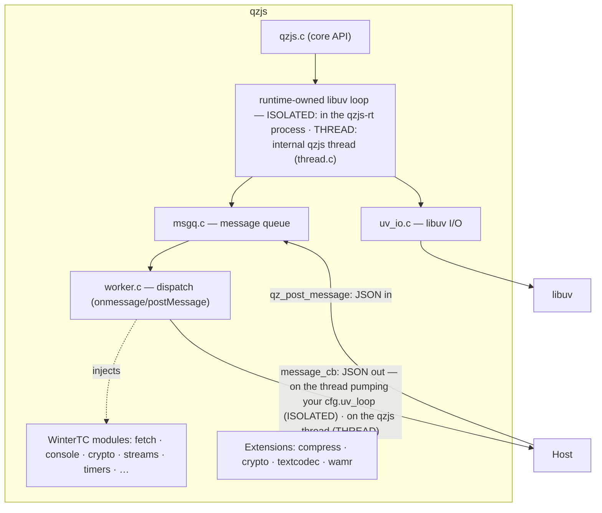

## Quick Start

```bash
# Clone with all submodules
git clone --recursive https://github.com/adam-ikari/qzjs.git
cd qzjs

# Configure and build
cmake -B build -DCMAKE_BUILD_TYPE=Release
cmake --build build -j$(nproc)
```

```c
#include <qzjs/qzjs.h>
#include <uv.h>
#include <stdio.h>

static void on_message(qz_t *rt, const char *json, size_t len, void *data) {
    (void)rt; (void)data;
    printf("received: %.*s\n", (int)len, json);
}

int main(void) {
    uv_loop_t loop;
    uv_loop_init(&loop);

    qz_config_t cfg = {0};
    cfg.initial_script = "globalThis.onmessage = function (e) { postMessage(e.data); };";
    cfg.message_cb = on_message;
    cfg.uv_loop = &loop;        /* host loop (required under ISOLATED) */
    qz_t *rt = qz_create(&cfg);
    if (!rt) return 1;
    qz_post_message(rt, "{\"cmd\":\"echo\",\"data\":\"hi\"}", 26);
    while (uv_run(&loop, UV_RUN_ONCE)) { /* pump: message_cb fires here */ }
    qz_destroy(rt);
    uv_loop_close(&loop);
    return 0;
}
```

Full walkthrough: [Quick Start](/guide/quickstart).

## Architecture


