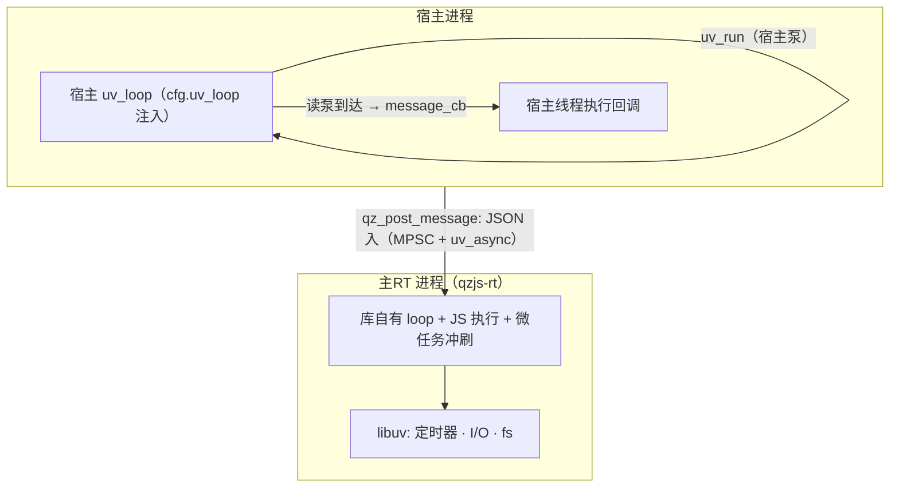

# 事件循环

qzjs 的事件循环有两种形态，由构建期 `QZ_PROCESS_MODEL`（缺省 `ISOLATED`）决定：

- **ISOLATED** — JS 跑在独立的主RT *进程*（`qzjs-rt`）里。库的宿主侧**不拥有任何线程和循环**：你通过 `cfg.uv_loop` 注入自己的 `uv_loop_t`，库把宿主侧通道句柄（管道读泵、wake async、发送溢出定时器）挂在它上面，`message_cb` **在泵你 loop 的线程上触发**。
- **THREAD** — 库启动一个内部 `qzjs` 线程运行嵌入式 libuv 循环。所有 JS 与 `message_cb` 都在该线程上运行；宿主什么都不用泵。

## 谁在运行循环（ISOLATED — 缺省）



宿主拥有自己的 loop 和泵的节奏；库只是借用。`qz_create` spawn 主RT 进程后，在同步 raw-fd 读上完成握手（期间不泵循环、不触发回调——ready 前的脚本消息会被缓冲，读泵注册后按 FIFO 重放），然后把通道句柄挂到 `cfg.uv_loop` 上。ISOLATED 下传 `cfg.uv_loop = NULL` 会让 `qz_create` 显式失败——库绝不回退到内部宿主线程。宿主与 libqzjs 必须链接**同一个** libuv。

## 谁在运行循环（THREAD 构建）

`qz_create` 启动一个专用内部线程（`uv_thread_t`），该线程运行一个 libuv 循环（嵌入式在运行时中的 `uv_loop_t`）。该循环驱动所有异步工作 — HTTP、文件 I/O、定时器 — 且所有 JS 都在同一线程上运行，因此 Promise 微任务在循环迭代之间自然排空。宿主线程从不触碰循环。

## 宿主如何驱动工作（ISOLATED）

```c
#include <qzjs/qzjs.h>
#include <uv.h>
#include <stdio.h>
#include <string.h>

static void on_message(qz_t *rt, const char *json, size_t len, void *data) {
    (void)rt; (void)data;
    printf("received: %.*s\n", (int)len, json);
}

int main(void) {
    uv_loop_t loop;
    uv_loop_init(&loop);

    qz_config_t cfg = {0};
    cfg.initial_script =
        "globalThis.onmessage = function (e) { postMessage('pong'); };";
    cfg.message_cb = on_message;
    cfg.uv_loop    = &loop;            /* 宿主 loop 注入（ISOLATED 必填） */

    qz_t *rt = qz_create(&cfg);
    if (!rt) return 1;

    qz_post_message(rt, "{\"cmd\":\"ping\"}", 14);

    /* 泵宿主 loop：reply 到达时 on_message 在本线程触发。宿主自己的
       事件调度可完全接管这里 —— 有 loop 要转的宿主天然就兼容。 */
    while (uv_run(&loop, UV_RUN_ONCE)) { /* until done */ }

    qz_destroy(rt);                     /* 库句柄已随 teardown 关闭 */
    uv_loop_close(&loop);
    return 0;
}
```

THREAD 构建下同一程序完全不需要 `uv_loop`：`message_cb` 在库的 qzjs 线程上触发，宿主做自己的事即可。

## 线程与重入规则

- `qz_post_message` 两个模型下都是线程安全的（JSON 会被拷贝）——可从任何线程调用。ISOLATED 下投递延迟等于你的泵频；同一 runtime 的 FIFO 顺序保持。
- ISOLATED 下阻塞型宿主 API（`qz_ping`、`qz_ping_path`、`qz_wait_idle`、`qz_destroy`）**在内部就地泵 `cfg.uv_loop`**（`UV_RUN_NOWAIT` + yield）——否则单线程宿主会自死锁。推论：`message_cb`（含崩溃 `{"type":"error"}` 上报）可能**在这些调用内重入触发**。
- 因此：**不要在 `message_cb` 内调用任何阻塞宿主 API**（嵌套 `uv_run`），并让回调保持轻量——它跑在你 loop 的线程上。重活放回你自己的线程/队列。
- 库从不对你的 loop 调 `uv_run(UV_RUN_DEFAULT)` 或 `uv_loop_close`；`qz_wait_idle`/`qz_destroy` 之后挂在上面的库句柄已全部关闭，宿主 loop 的 `uv_loop_close` 可以成功返回。

## 为什么这样设计

- ISOLATED 让宿主掌好自己的事件循环：零库侧宿主线程，集成方式就是「传入你的 loop、继续你的泵」。
- JS 执行与所有异步事件在主RT 进程的单一 loop 内串行化——运行时内部无锁、无竞争。
- 微任务在循环迭代之间自动排空（ISOLATED 在主RT 进程内，THREAD 在 qzjs 线程上）。
