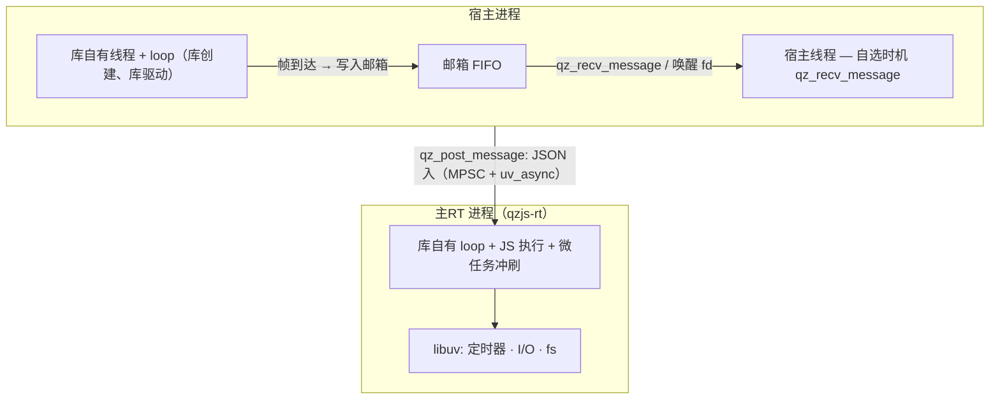

# 事件循环

qzjs 的事件循环有两种形态，由构建期 `QZ_PROCESS_MODEL`（缺省 `ISOLATED`）决定。两种形态的故事是同一个：**库驱动自己的 loop/线程，从不执行宿主代码**。宿主不运行也不注入 loop——只在自己的线程上自选时机消费邮箱：

- **ISOLATED** — JS 跑在独立的主RT *进程*（`qzjs-rt`）里；此外库还在宿主进程内启动**自己的宿主侧线程 + loop**。所有发往宿主的消息（JS `postMessage`、崩溃上报 `{"type":"error"}`、CONTROL 回执）都写入每个 runtime 一条的 FIFO **邮箱**，用 `qz_recv_message` 排干。
- **THREAD** — 库启动一个内部 `qzjs` 线程运行嵌入式 libuv 循环。所有 JS 都在该线程上运行；输出进入同一个邮箱。

## 谁在运行循环（ISOLATED — 缺省）



边界两侧的每一个线程和 loop 都归库所有，不向宿主借用任何东西。`qz_create` spawn 主RT 进程后，在同步 raw-fd 读上完成 ready 握手，并启动库的宿主侧线程。ready 前到达的帧已被重放进邮箱，宿主的第一个 `qz_recv_message` 就能拿到。宿主不注入 loop、不驱动任何东西，宿主与 libqzjs 之间也**没有同链接 libuv 的义务**——libuv 是库的内部依赖（宿主可把 qzjs 嵌入任何事件系统：poll/epoll/select、自己的线程，或什么都不用）。

## 谁在运行循环（THREAD 构建）

`qz_create` 启动一个专用内部线程（`uv_thread_t`），该线程运行一个 libuv 循环（嵌入式在运行时中的 `uv_loop_t`）。该循环驱动所有异步工作 — HTTP、文件 I/O、定时器 — 且所有 JS 都在同一线程上运行，因此 Promise 微任务在循环迭代之间自然排空。宿主线程从不触碰循环；它只读邮箱。

## 宿主如何消费输出（ISOLATED）

```c
#include <qzjs/qzjs.h>
#include <stdio.h>

static void host_drain(qz_t *rt, int timeout_ms) {
    for (;;) {
        char *json = NULL; size_t len = 0;
        int r = qz_recv_message(rt, &json, &len, timeout_ms);
        if (r != 0) break;
        printf("received: %.*s\n", (int)len, json);
        qz_free_message(json);
        timeout_ms = 0;   /* 首条到达后转纯轮询排干 */
    }
}

int main(void) {
    qz_config_t cfg = {0};
    cfg.initial_script =
        "globalThis.onmessage = function (e) { postMessage('pong'); };";

    qz_t *rt = qz_create(&cfg);
    if (!rt) return 1;

    qz_post_message(rt, "{\"cmd\":\"ping\"}", 14);

    /* 在本线程、按自己的节奏消费邮箱 —— 库自己驱动，宿主无需驱动任何东西。 */
    host_drain(rt, 2000);

    qz_destroy(rt);
    return 0;
}
```

这个程序是纯 POSIX 的：没有 libuv，也没有要运行的 loop。THREAD 构建下同一程序原样可用。

### 接入你自己的事件系统（唤醒 fd）

若想在既有的 poll/epoll/select 循环里避免纯阻塞等待，把 `qz_message_fd(rt)` 加进你的 fd 集合：它是一个 `eventfd`（单调计数、非阻塞、CLOEXEC），当有 ≥1 条消息待取时变为可读。等 fd 时遵循以下协议——消息是先链入邮箱、后写 eventfd，所以「先排干、再清 fd、再复查」的顺序不会丢唤醒：

1. `qz_recv_message(rt, &json, &len, 0)` —— 排干并**处理**，直到返回非 0。
2. `read(qz_message_fd(rt), ...)` —— 清 eventfd 计数，直到 `EAGAIN`。
3. 再探一次 `qz_recv_message(..., 0)` —— 若取到消息就回到第 1 步处理；只有确认为空时才可以安全地 `poll()` 阻塞。

fd 归 runtime 所有：不得 close；`qz_free` 后失效。仅 Linux。

### 接入宿主自己的 libuv loop

qzjs 本身就是 libuv-native 运行时，最常见的宿主形态是：应用已经有一个 `uv_loop_t`。用 `uv_poll_t` 把唤醒 fd 挂进**你自己的** loop 即可——库在私有线程上跑它自己的 loop，两个 `uv_loop_t` 实例互不干涉：

```c
int mfd = qz_message_fd(rt);                 // 裸 eventfd
uv_poll_t req;

static void on_mailbox(uv_poll_t *h, int status, int events) {
    char *json; size_t len;
    for (;;) {
        // 第 1 步：排干并处理（此处 timeout_ms 必须是 0）
        while (qz_recv_message(rt, &json, &len, 0) == 0) {
            handle(json, len);
            qz_free_message(json);
        }
        // 第 2 步：清 eventfd 计数，直到 EAGAIN
        uint64_t c;
        while (read(mfd, &c, sizeof c) == (ssize_t)sizeof c) {}
        // 第 3 步：再探一次。这里冒出来的消息是在第 1-2 步之间到的，
        // 它对 eventfd 的写可能已被第 2 步读走——所以要回到第 1 步
        // （顺带再清一次计数），而不是直接回 poll。只处理一条就返回的
        // 写法会把剩下的消息滞留：邮箱非空、fd 已清零、再没有唤醒。
        if (qz_recv_message(rt, &json, &len, 0) != 0) break;
        handle(json, len);
        qz_free_message(json);
    }
}

uv_poll_init(uv_loop, &req, mfd);            // 宿主自有 loop
uv_poll_start(&req, UV_READABLE, on_mailbox);
```

uv 场景的两条专属约束：

- **poll 回调内绝不传 `timeout_ms > 0`（或 `-1`）**——`qz_recv_message` 会对宿主 loop 自己的线程调用 `poll()` 并阻塞它。在回调里只用 `0`（纯轮询）排干；带超时的阻塞 `recv(ms)` 只适合 loop 之外的专用线程。
- **释放 runtime 前先摘句柄。** `qz_free`/`qz_destroy` 会 close `out_efd`。若 rt 释放时仍有 `uv_poll_t` 挂在该 fd 上，fd 号可能被别的文件复用，回调就会打到无关描述符上。正确顺序：`qz_wait_idle` → 用 `recv(0)` 末次排干 → `uv_poll_stop(&req)`（要回收句柄内存再 `uv_close`）→ `qz_free(rt)`。`uv_poll_stop` 只解除挂起、不 close fd，正好匹配「fd 归 rt 所有」的契约。

## 线程与重入规则

- `qz_post_message` 两个模型下都是线程安全的（JSON 会被拷贝）——可从任何线程调用。同一 runtime 的 FIFO 顺序保持；投递由库自有线程驱动，不依赖宿主的调度。
- `qz_recv_message` 可从任何线程调用，但同一 runtime **同一时刻只允许一个消费者**：邮箱出队并非互斥，两个线程并发弹出会各读到同一个 head 节点——同一条消息交付两次、同一节点释放两次。消费须由宿主串行化；取走消息的跨线程所有权交接由宿主负责。
- 阻塞型 API（`qz_ping`、`qz_ping_path`、`qz_wait_idle`、`qz_destroy`）阻塞的是**调用线程**——等待是调用方在等（ping 是带退避的短睡轮询，wait_idle/destroy 是 join），库自有线程在这期间照常转 loop 并回填回执。邮箱不受影响——等待期间出站消息（含崩溃 `{"type":"error"}` 上报）持续进入邮箱，`qz_wait_idle` 返回后、`qz_free` 之前 `qz_recv_message` 依然可用。
- 没有需要绕开的重入隐患：qzjs 从不执行宿主代码，任何库线程都不会回调进你。在你喜欢的那个线程上排干邮箱即可。
- 未消费的消息在 `qz_destroy`/`qz_free` 时被释放（不泄漏，此后不可达）——需要就先排干。

## 为什么这样设计

- 宿主可把 qzjs 嵌入**任何**事件系统——poll/epoll/select、自己的线程、或什么都不用：库自主管理线程与 loop，从不执行宿主代码；宿主只需自选线程、自选时机消费邮箱。
- JS 执行与所有异步事件在主RT 进程的单一 loop 内串行化——运行时内部无锁、无竞争。
- 微任务在循环迭代之间自动排空（ISOLATED 在主RT 进程内，THREAD 在 qzjs 线程上）。
