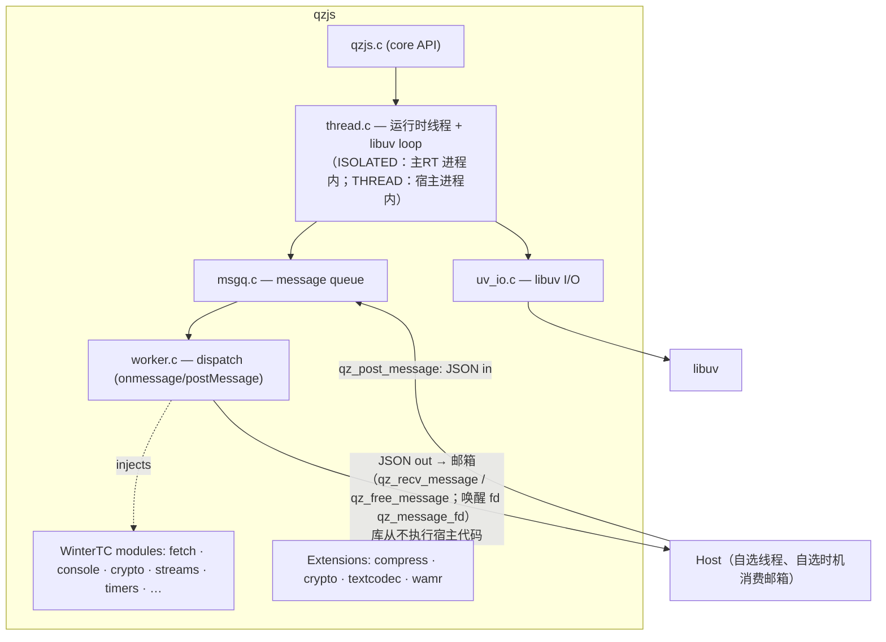

## 快速开始

```bash
# Clone with all submodules
git clone --recursive https://github.com/adam-ikari/qzjs.git
cd qzjs

# Configure and build
cmake -B build -DCMAKE_BUILD_TYPE=Release
cmake --build build -j$(nproc)
```

```c
#include <qzjs/qzjs.h>
#include <stdio.h>

int main(void) {
    qz_config_t cfg = {0};
    cfg.initial_script = "postMessage({hello: 'world'});";
    qz_t *rt = qz_create(&cfg);   // 无回调、无 loop 注入
    if (!rt) return 1;
    qz_post_message(rt, "{\"cmd\":\"echo\",\"data\":\"hi\"}", 26);
    for (;;) {
        char *json = NULL; size_t len = 0;
        if (qz_recv_message(rt, &json, &len, 5000) != 0) break;  // 消费邮箱
        printf("received: %.*s\n", (int)len, json);
        qz_free_message(json);
    }
    qz_destroy(rt);
    return 0;
}
```

完整步骤见[快速开始](/zh/guide/quickstart)。

## 架构


